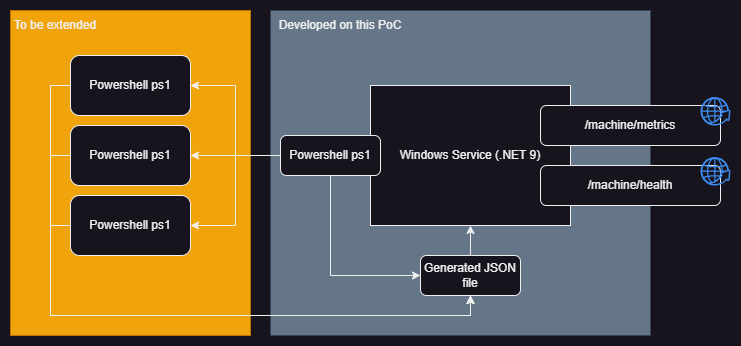

# SampleService

A .NET 9 Windows Service application that combines background PowerShell script execution with HTTP API endpoints for system monitoring and metrics collection.

## Features

- **Background Service**: Executes PowerShell scripts at configurable intervals (default: 6 hours)
- **HTTP API**: Serves system metrics and health status via REST endpoints
- **Windows Service**: Runs as a Windows Service with automatic startup capability
- **Configurable**: Easy configuration through `appsettings.json`
- **Logging**: Comprehensive logging with Windows Event Log integration

## Architecture



- **Target Framework**: .NET 9
- **Service Type**: Hybrid Web Application + Background Service
- **Deployment**: Windows Service with HTTP endpoints

## API Endpoints

### GET `/machine/metrics`
Returns directory information collected by the PowerShell script.

**Response**: JSON containing directory structure
```json
{
  "RootPath": "C:\\Users\\CTW03771\\source\\repos\\SampleService",
  "Directories": [
    "C:\\Users\\CTW03771\\source\\repos\\SampleService\\bin",
    "C:\\Users\\CTW03771\\source\\repos\\SampleService\\obj",
    "..."
  ]
}
```

### GET `/machine/health`
Returns service health status.

**Response**: 
```json
{
  "status": "healthy",
  "timestamp": "2024-01-01T12:00:00Z"
}
```

## Configuration

Configure the service through `appsettings.json`:

```json
{
  "WorkerSettings": {
    "IntervalHours": 6,
    "ScriptPath": "PWSscript.ps1"
  },
  "Urls": "http://localhost:5000;https://localhost:5001"
}
```

### Configuration Options

- **IntervalHours**: How often to execute the PowerShell script (in hours)
- **ScriptPath**: Path to the PowerShell script to execute
- **Urls**: HTTP endpoints the service will listen on

## PowerShell Script (just for example purpose)

The included `PWSscript.ps1` script:
- Scans directory structures recursively
- Generates JSON output with directory listings
- Can be customized for different system monitoring tasks

## Installation

### Prerequisites
- .NET 9 Runtime

### Build and Publish

```bash
# Build the application
dotnet build -c Release

# Publish for deployment
dotnet publish -c Release -r win-x64 --self-contained true
```

### Install as Windows Service

1. **Navigate to published output:**
   ```cmd
   cd bin\Release\net9.0\win-x64\publish
   ```

2. **Create the service (run as Administrator):**
   ```cmd
   sc create "SampleService" binPath="C:\Full\Path\To\Published\SampleService.exe" start=auto
   ```

3. **Start the service:**
   ```cmd
   sc start "SampleService"
   ```

### Alternative PowerShell Commands

```powershell
# Create service
New-Service -Name "SampleService" -BinaryPathName "C:\Full\Path\To\Published\SampleService.exe" -StartupType Automatic

# Start service
Start-Service -Name "SampleService"

# Stop service
Stop-Service -Name "SampleService"

# Remove service
Remove-Service -Name "SampleService"
```

## Development

### Running in Development Mode

```bash
# Run as console application
dotnet run
```

The application will start both the background worker and HTTP server. Access the endpoints at:
- http://localhost:5000/machine/metrics
- http://localhost:5000/health

### Project Structure

```
SampleService/
├── Endpoints/
│   └── EndpointExtensions.cs    # HTTP endpoint definitions
├── Workers/
│   ├── Worker.cs               # Background service implementation
│   └── WorkerSettings.cs       # Configuration model
├── Properties/
│   └── launchSettings.json     # Development launch settings
├── PWSscript.ps1               # PowerShell script for metrics collection
├── appsettings.json            # Application configuration
├── Program.cs                  # Application entry point
└── SampleService.csproj        # Project file
```

## Logging

The service logs to multiple destinations:

- **Console**: During development and testing
- **Windows Event Log**: When running as Windows Service

### Event Log Configuration

Events are logged under the source name "SampleService" in the Windows Application Event Log.

## Monitoring

### Service Status
Check service status through Windows Services management console or PowerShell:

```powershell
Get-Service -Name "SampleService"
```

### Health Check
Monitor service health via HTTP endpoint:

```bash
curl http://localhost:5000/health
```

### Logs
View logs in Windows Event Viewer:
1. Open Event Viewer
2. Navigate to Windows Logs > Application
3. Filter by Source: "SampleService"
